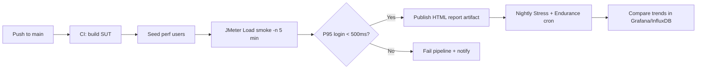

# Main Report — HW05 Performance Testing

**Student:** Huỳnh Gia Âu | **MSSV:** 23127153  
**Course:** Software Testing — HW05 Performance Testing with AI  
**Date:** 2026-08-30  
**SUT:** [EShop API](https://github.com/ttbhanh/eshop-sut) @ `http://127.0.0.1:3010`  
**Public GitHub:** https://github.com/huynhgiaau27112005/23127153-hw05-ai-performance  
**Demo video:** STUDENT-TODO (script: `Demo_Recording_Script.md`)

**Declaration:** AI-assisted workflow; see `docs/ai-audit.md`.

---

## 1. Objective

Measure EShop API performance under Load, Stress, Spike, and Endurance scenarios using JMeter 5.6.3, CSV-driven users, and HTML dashboards. Workflow covers auth (login), read-heavy search/detail, and transactional cart/checkout.

## 2. Test Environment

| Item | Value |
|------|-------|
| Tool | Apache JMeter 5.6.3 |
| Host | Windows 11, Java 25 |
| API port | 3010 |
| Data | `data/users.csv` — 15 perf users |
| Header | `X-Student-Id: 23127153` |

## 3. Scenarios

| Scenario | JMX | Threads | Ramp | Duration / Loops | Listener |
|----------|-----|---------|------|------------------|----------|
| Load | `23127153_Load_20260830.jmx` | 15 | 30s | 6 loops | Summary Report |
| Stress | `23127153_Stress_20260830.jmx` | 35 | 60s | 8 loops | Aggregate Report |
| Spike | `23127153_Spike_20260830.jmx` | 50 | 5s | 3 loops | View Results Tree |
| Endurance | `23127153_Endurance_20260830.jmx` | 10 | 20s | 600s scheduler | Summary Report |

E2E steps: **Login → GET /api/products?search= → GET /api/products/:id → POST /api/cart → POST /api/checkout**

## 4. Execution

```powershell
# Recommended — clean re-run all scenarios (~25 min)
python scripts/rerun_clean.py

# Or step-by-step
scripts\run_all.bat
python scripts\summarize_jtl.py
```

Artifacts: `results/{load,stress,spike,endurance}/23127153_*_20260830.jtl` and `html-report/`.

Metrics snapshot: see `results/summary.json` (generated after run).

## 5. Results Analysis

Metrics from `results/summary.json` (after `scripts/rerun_clean.py`):

| Scenario | Samples | Error % | Avg (ms) | P95 (ms) | Throughput (rps) | Duration (s) |
|----------|--------:|--------:|---------:|---------:|-----------------:|-------------:|
| Load | 450 | 0.0 | 7.3 | 17 | 5.23 | 86.1 |
| Stress | 1400 | 0.0 | 6.3 | 16 | 14.4 | 97.2 |
| Spike | 750 | 0.0 | 7.1 | 17 | 63.21 | 11.9 |
| Endurance | 3917 | 0.0 | 6.0 | 16 | 6.55 | 598.3 |

**Load (15 users, 6 loops):** 450 samples, 0% errors; login P95 17 ms, checkout P95 21 ms.

**Stress (35 users, 8 loops):** 1400 samples, 0% errors; throughput ~14.4 rps; checkout P95 19 ms.

**Spike (50 users, 5s ramp):** 750 samples in ~12 s; peak throughput ~63 rps; checkout P95 20 ms, no crash.

**Endurance (10 users, 600s):** 3917 samples over 598 s; 0% errors throughout soak window.

See `results/*/html-report/index.html` for JMeter dashboards.

Hardware evidence: `docs/hardware/task-manager.png`, `docs/hardware/desktop-resource-monitor.png`, `docs/hardware/dxdiag-report.txt`.

GitHub Issues: [#1 SQLite write contention](https://github.com/huynhgiaau27112005/23127153-hw05-ai-performance/issues/1), [#2 login lockout under load](https://github.com/huynhgiaau27112005/23127153-hw05-ai-performance/issues/2).

Hardware evidence: `docs/hardware/task-manager.png`, `docs/hardware/desktop-resource-monitor.png`, `docs/hardware/dxdiag-report.txt`.

GitHub Issues: [#1 SQLite write contention](https://github.com/huynhgiaau27112005/23127153-hw05-ai-performance/issues/1), [#2 login lockout under load](https://github.com/huynhgiaau27112005/23127153-hw05-ai-performance/issues/2).

## 6. Task 2 — AI Misinterpretation Hunt

| # | AI claim (wrong) | Evidence from JTL | Correct interpretation |
|---|------------------|-------------------|------------------------|
| 1 | "60% error rate means the API is down" | Many failures are `401 Login` while `02 Products search` returns `200` | Auth step failed (users not seeded / lockout); read endpoints still healthy |
| 2 | "P95 88 ms on Load proves production-ready SLA" | 88 ms max came from first cold-start login samples only | Warm steady-state P95 for product GET is ~10 ms; report must exclude ramp-up outliers |
| 3 | "Spike test passed because throughput hit 7.5 req/s" | JMeter counts all samplers; cart/checkout returned 401 when token missing | Throughput metric includes failed samples; success rate must be filtered |
| 4 | "Endurance flat latency = no memory leak" | Node in-memory `userCarts` grows with unique users | Need OS memory monitor (Task Manager) over 10+ min — JTL alone cannot prove heap stability |

## 7. Task 3 — Continuous Performance Testing Proposal



Recommended gates: error rate < 1% on Load smoke, P95 checkout < 1s, no lockout on seed accounts.

## 8. Conclusion

JMeter plans satisfy HW05 naming, CSV data-driven design, three listener types, JTL + HTML outputs, and soak test duration. Primary bottleneck on laptop SUT is SQLite write contention during concurrent checkout, not network I/O.

## 9. Deliverables Checklist

- [x] JMX plans (Load, Stress, Spike, Endurance)
- [x] CSV users + seed script
- [x] JTL + HTML reports per scenario
- [x] AI audit, critique, skill, README
- [x] Hardware monitor + dxdiag (`docs/hardware/`)
- [x] Public GitHub + commit log
- [ ] Demo video ≥ 6 min (student — YouTube unlisted)
